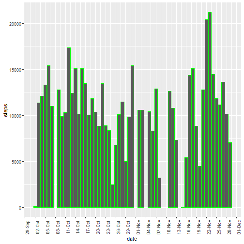
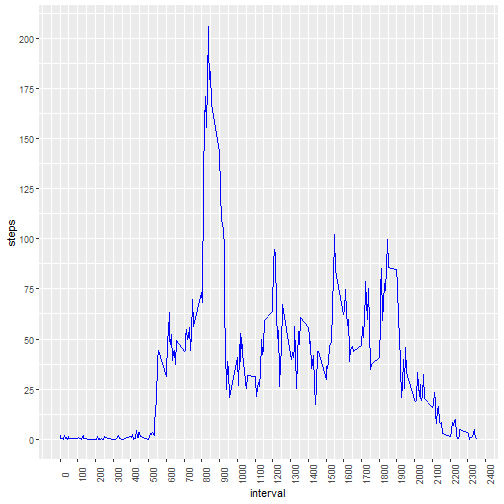
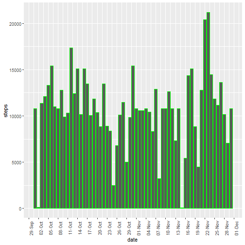
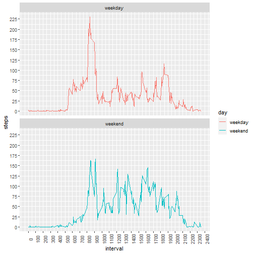

1.  Loading the required libraries


```r
knitr::opts_chunk$set(echo = TRUE)
library(ggplot2)
library(dplyr)
```

```
## 
## Attaching package: 'dplyr'
```

```
## The following objects are masked from 'package:stats':
## 
##     filter, lag
```

```
## The following objects are masked from 'package:base':
## 
##     intersect, setdiff, setequal, union
```

```r
library(knitr)
library(png)
```

```
## Error in library(png): there is no package called 'png'
```

2.  Unzipping,reading, and processing data:


```r
unzip("activity.zip")
activity<-read.csv("activity.csv")
activity$date=as.Date(activity$date, '%Y-%m-%d')
```


3. Creating a dataframe of total number of steps taken each day:


```r
activity$date=as.Date(activity$date, '%Y-%m-%d')
by_day<-group_by(activity, date)
sum_steps<-summarize(by_day, steps=sum(steps), .groups = 'drop')
head(sum_steps)
```

```
## # A tibble: 6 x 2
##   date       steps
##   <date>     <int>
## 1 2012-10-01    NA
## 2 2012-10-02   126
## 3 2012-10-03 11352
## 4 2012-10-04 12116
## 5 2012-10-05 13294
## 6 2012-10-06 15420
```
4. Plotting a histogram for total number of steps taken each day


```r
ggplot(sum_steps,aes(x=date,y=steps)) +
        geom_bar(stat="identity", color="green") +
        scale_x_date( date_breaks = "3 days", date_labels = "%d-%b")+
        theme(axis.text.x=element_text(angle=90))
```

```
## Warning: Removed 8 rows containing missing values (position_stack).
```



5. Calculating mean of total daily steps:


```r
mean(sum_steps$steps, na.rm=TRUE)
```

```
## [1] 10766.19
```

6. Calculating median of total daily steps:


```r
median(sum_steps$steps, na.rm=TRUE)
```

```
## [1] 10765
```

7. Creating a dataframe of average number of steps per each interval across all days:


```r
by_interval<-group_by(activity, interval)
avg_steps<-summarize(by_interval, steps=mean(steps,na.rm=TRUE), .groups = 'drop')
head(avg_steps)
```

```
## # A tibble: 6 x 2
##   interval  steps
##      <int>  <dbl>
## 1        0 1.72  
## 2        5 0.340 
## 3       10 0.132 
## 4       15 0.151 
## 5       20 0.0755
## 6       25 2.09
```

8. Plotting average number of steps per each interval across all days:


```r
ggplot(avg_steps,aes(x=interval,y=steps)) +
        geom_line(color="blue") + 
        scale_x_continuous(breaks=seq(0,2400,100)) +
        scale_y_continuous(breaks=seq(0,225,25)) +
        theme(axis.text.x=element_text(angle=90))
```




9. Calculating the interval with the maximum number of steps (average across all days)


```r
avg_steps[avg_steps$steps==max(avg_steps$steps),]
```

```
## # A tibble: 1 x 2
##   interval steps
##      <int> <dbl>
## 1      835  206.
```
10.  Calculating number of NA values for steps:

```r
nrow(activity)*mean(is.na(activity$steps))
```

```
## [1] 2304
```

11. Replacing NA values with mean values for the interval 


```r
activity2<-activity
for (row in 1:nrow(activity2)) {
        if (is.na(activity2[row,1])) {
                na_interval<-activity2[row,3]
                avg<-mean(activity2[activity2$interval==na_interval,1], na.rm=TRUE)
                activity2[row,1]<-avg
        }
}
```


12. Creating a dataframe of total number of steps taken each day (with replaced NA):


```r
activity2$date=as.Date(activity2$date, '%Y-%m-%d')
by_day2<-group_by(activity2, date)
sum_steps2<-summarize(by_day2, steps=sum(steps), .groups = 'drop')
head(sum_steps2)
```

```
## # A tibble: 6 x 2
##   date        steps
##   <date>      <dbl>
## 1 2012-10-01 10766.
## 2 2012-10-02   126 
## 3 2012-10-03 11352 
## 4 2012-10-04 12116 
## 5 2012-10-05 13294 
## 6 2012-10-06 15420
```
13. Plotting a histogram for total number of steps taken each day (with NA replaced)


```r
ggplot(sum_steps2,aes(x=date,y=steps)) +
        geom_bar(stat="identity", color="green") +
        scale_x_date( date_breaks = "3 days", date_labels = "%d-%b")+
        theme(axis.text.x=element_text(angle=90))
```



14. Calculating mean of total daily steps (with replaced NA):


```r
mean(sum_steps2$steps, na.rm=TRUE)
```

```
## [1] 10766.19
```

15. Calculating median of total daily steps (with replaced NA):


```r
median(sum_steps2$steps, na.rm=TRUE)
```

```
## [1] 10766.19
```

16. Adding factor variable for weekend/weekdays values:


```r
activity2$day<-factor(if_else(weekdays(activity2[,2]) %in% c('Saturday','Sunday'),'weekend', 'weekday'))
str(activity2$day)
```

```
##  Factor w/ 2 levels "weekday","weekend": 1 1 1 1 1 1 1 1 1 1 ...
```

17. Creating a dataframe of average number of steps per each interval for weekdays:


```r
by_weekday_int<-group_by(activity2, interval,day)
avg_weekday<-summarize(by_weekday_int, steps=mean(steps), .groups = 'drop')
head(avg_weekday)
```

```
## # A tibble: 6 x 3
##   interval day      steps
##      <int> <fct>    <dbl>
## 1        0 weekday 2.25  
## 2        0 weekend 0.215 
## 3        5 weekday 0.445 
## 4        5 weekend 0.0425
## 5       10 weekday 0.173 
## 6       10 weekend 0.0165
```

18. Comparing average number of steps per each interval for weekends and weekdays:


```r
ggplot(avg_weekday, aes(x=interval,y=steps, color=day)) +
        geom_line() + 
        scale_x_continuous(breaks=seq(0,2400,100)) +
        scale_y_continuous(breaks=seq(0,225,25)) +
        theme(axis.text.x=element_text(angle=90))+
  facet_wrap(~day,  ncol=1)
```



